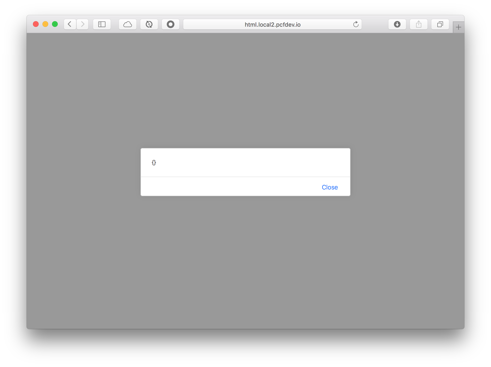
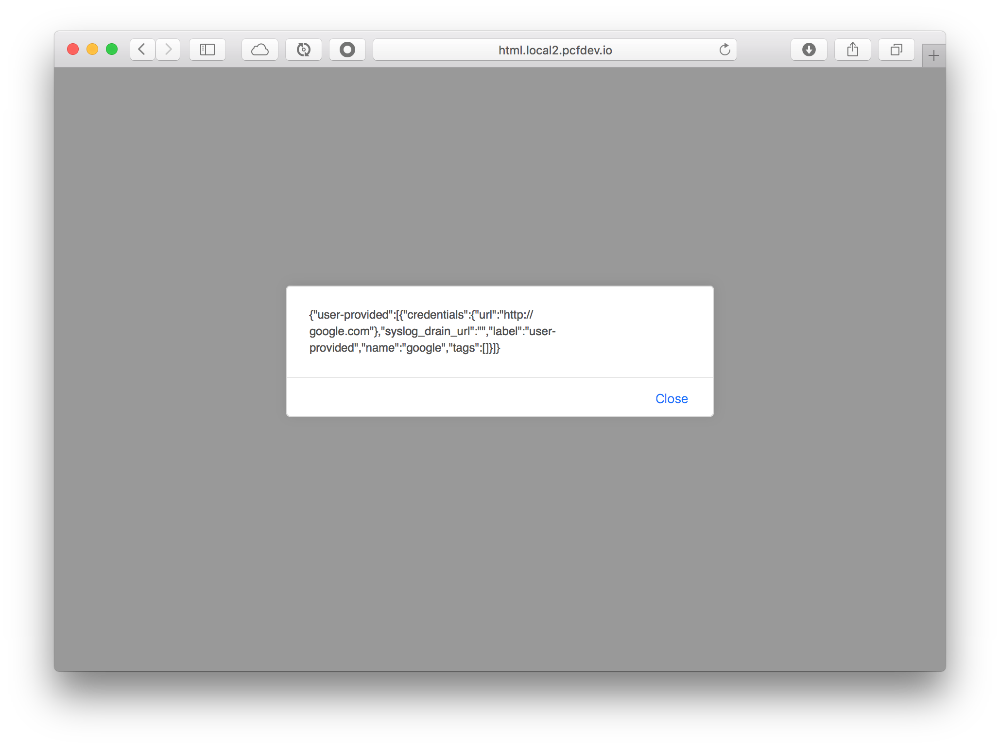

= JavaScript Custom BuildPack

== Problem
When your application is bound to a service the *VCAP_SERVICES* environment variable is set, and you can use it to find the credentials, urls and other useful information; but I've seen this working only on *_server_side_* technologies like Java, NodeJS, Python among other but nothing related to a pure JavaScript apps. If you search for reading environment variables from JavaScript you will find that is not possible.

== Solution
Create a JavaScript BuildPack that allows to have access to the environment variables.

[NOTE]
====
This solution will use only the *VCAP_SERVICES* environment variable and it will be based on the *_staticfile_buildpack_*.
====

. Fork/Clone the Static BuildPack from: https://github.com/cloudfoundry/staticfile-buildpack
. Fetch the submodules and get the dependencies:
+
[source,bash]
----
 $ git submodule update --init
 $ BUNDLE_GEMFILE=cf.Gemfile bundle
----
+
As you can see, you will need *ruby* installed.

. Modify the *_bin/compile_* script by adding the following snippet *after* the `source $compile_buildpack_dir/bin/common.sh` command (around line 17/18).
+
[source,bash]
----
source $compile_buildpack_dir/bin/envvar.sh
----
+
You will create the *_bin/envvar.sh_* script in the next steps.
. Modify the *_bin/compile_* script by adding the following snippet *one line before* of the `shopt -u extglob` command (around line 50/51).

+
[source,bash]
----
 if [[ -d "$build_dir/public/js" ]]; then
    status "[FOUND]] JavaScript folder $build_dir/public/js"
    addenv $build_dir/public/js/
 fi
----
+
This code will look for a *js* folder in the current app and if it's found then, it will execute the *addenv* function. (Will see the *addenv* function next).
. Create a *_envvar.sh_* script in the *_bin/_* folder with the following code:
+
[source,bash]
----
addenv(){
	SCRIPT=" \
	(function (window) { \
	  window.__env = window.__env || {}; \
	  window.__env.VCAP_SERVICES = $VCAP_SERVICES \
	}(this));"

	echo $SCRIPT >> $1/env.js
}
----
+
If you analyze this code, it will read the *VCAP_SERVICES* environment variable and add it to the variable _SCRIPT_ that will be echoed to the *js/env.js* script. Then you can use this *js/env.js* script directly in your html page.

== Testing the JavaScript BuildPack

. Login into Cloud Foundry as an admin.
. Let's pack and upload the BuildPack to Cloud Foundry:
+
[source,bash]
----
$ BUNDLE_GEMFILE=cf.Gemfile bundle exec buildpack-packager --cached
$ mv staticfile_buildpack-cached-v1.3.10.zip js_buildpack.zip
$ cf create-buildpack js_buildpack js_buildpack.zip 1
----
+
[NOTE]
====
Remeber that you need to be an *admin* in your Cloud Foundry instance. For this tutorial/notes I used the PCFDev (https://pivotal.io/pcf-dev) instance.
====
. Review that the *_js_buildpack_* is listed by executing:
+
[source,bash]
----
$ cf buildpacks
Getting buildpacks...

buildpack              position   enabled   locked   filename
js_buildpack           1          true      false    js_buildpack.zip
java_buildpack         2          true      false    java-buildpack-offline-v3.6.zip
ruby_buildpack         3          true      false    ruby_buildpack-cached-v1.6.16.zip
nodejs_buildpack       4          true      false    nodejs_buildpack-cached-v1.5.11.zip
go_buildpack           5          true      false    go_buildpack-cached-v1.7.5.zip
python_buildpack       6          true      false    python_buildpack-cached-v1.5.5.zip
php_buildpack          7          true      false    php_buildpack-cached-v4.3.10.zip
staticfile_buildpack   7          true      false    staticfile_buildpack-cached-v1.3.6.zip
binary_buildpack       8          true      false    binary_buildpack-cached-v1.0.1.zip
----
+
You should see the *_js_buildpack_* is listed in the position 1.
. Create a HTML/JavaScript application. Execute the following commands:
+
[source,bash]
----
$ mkdir -p js-example/js
$ cd js-example
----
. Create a *Staticfile* (this is necessary as a based of the *_staticfile_buildpack_* that now is your *_js_buildpack_* because the *detect* script will look for this file in order to continue with the next phases).
+
[source,bash]
----
$ touch Staticfile
----
. Create an *index.html* file with the following content:
+
[source,html]
----
<html>
  <head>
    
    
    
    
  </head>
  <body>
  </body>
</html>
----
+
Here we are using *jquery* and the *js/log.js* (that will be created next) and the *_js/env.js_* that will be generated by the *compile* phase of the *_js_buildpack_*.
. Create the *js/log.js* file with the following content:
+
[source,javascript]
----
function log(text){
  console.log(text);
}
----
+
Nothing special about this file, just a simple console log.
. Push the app into Cloud Foundry and use the *js_buildpack*
+
[source,bash]
----
$ cf push html -b js_buildpack
----
. Go to your browser and point to the app. (In PCFDev I needed to go to: http://html.local2.pcfdev.io)
+

+
Is empty? why? Remember that you haven't bind any services, meaning that the *VCAP_SERVICES* is not set. You can see this by executing: `$ cf env html`
. Let's create *CUPS* service and bind it to the app:
+
[source,bash]
----
$ cf cups google -p "url"

url> http://google.com
Creating user provided service google in org pcfdev-org / space pcfdev-space as admin...
OK

$ cf bind-service html google
Binding service google to app html in org pcfdev-org / space pcfdev-space as admin...
OK
TIP: Use 'cf restage html' to ensure your env variable changes take effect
----
. Restage the app
+
[source,bash]
----
$ cf restage html
----
. Go to your browser and point to the app.
+

+
Now we have the *VCAP_SERVICES* environment variable set.

=== My Thoughts

Probably this is a simple example and can be done in a different way, perhaps by overriding some variables that allows to create the *env.js*. The final *env.js* file only has the _VCAP_SERVICES_ variable but what happen if you need more info, like the _VCAP_APPLICATION_ or any other variable; well, that's up to you how you want to implemented.
